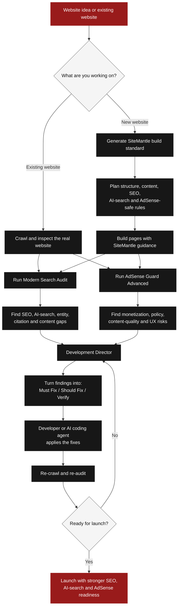

# SiteMantle

> **Build websites search engines, AI systems, users, and publishers can trust.**

**SiteMantle** is an evidence-first website development and auditing system for **modern SEO, AI-search readiness, content quality, and Google AdSense readiness**.

It is designed for two moments:

1. **Before a website is built** — SiteMantle gives the developer or AI coding agent a build standard so SEO and monetization requirements are considered from day one.
2. **After a website exists** — SiteMantle crawls the real site, finds page-level gaps, explains the evidence, and turns the findings into an ordered implementation plan.

SiteMantle is **not a dashboard** and it is not another opaque “SEO score” generator. Its job is to inspect, direct, verify, and explain.

---

## From idea to launch with SiteMantle

SiteMantle supports both sides of the website lifecycle:

- **New website** → define the build standard before development starts.
- **Existing website** → inspect the real site, identify gaps, direct the fixes, and verify the result.

Instead of treating SEO, AI-search readiness, and AdSense as separate checks at the end, SiteMantle brings them into one evidence-first development loop.



### What this workflow means

**1. Start with the real situation.** SiteMantle works whether the project is only an idea or already exists online.

**2. Prevent problems before they are built.** For a new site, SiteMantle creates development rules for structure, content, SEO, AI-search readiness, and AdSense-safe design before implementation begins.

**3. Inspect the real website with evidence.** Once pages exist, SiteMantle crawls them and evaluates what is actually present instead of guessing from templates or intentions.

**4. Turn findings into work.** The Development Director converts evidence into **Must Fix**, **Should Fix**, and **Verify** instructions that a developer or AI coding agent can follow.

**5. Re-check before launch.** A fix is not treated as complete until a fresh crawl and audit support it.

### The principle

**Do not build first and discover the rules later.**

SiteMantle moves SEO, AI-search readiness, content quality, and publisher-readiness checks into the development process itself.

---

# What SiteMantle does

## 1. Pre-Build AdSense Standard

For a new AdSense-first website, SiteMantle can generate the development standard **before the first crawl exists**.

```bash
sitemantle adsense-build-standard --out plans/my-site
```

It produces:

```text
plans/my-site/
├── adsense-build-standard.json
└── adsense-build-standard.md
```

The standard tells a developer or coding agent how to structure the site before launch, including requirements such as:

- keep public monetized pages separate from user-specific processing/result states;
- avoid ads on upload, processing, preview, result, and download states;
- provide useful original publisher content around public tools;
- keep ads visually and spatially separate from Download, Convert, Play, Next, and navigation controls;
- avoid thin, replicated, lightly rewritten, or mass-generated pages;
- include appropriate privacy and publisher-transparency information;
- treat third-party media-download features as a high rights/provider-policy risk requiring explicit review.

This is a **development standard**, not a promise of Google AdSense approval.

---

## 2. Website Crawl & Evidence Collection

SiteMantle first observes the actual website instead of guessing from a URL.

```bash
sitemantle crawl https://example.com \
  --out runs/example \
  --audit-depth standard
```

The crawler can inspect:

- robots.txt and sitemap discovery;
- HTTP and optional browser-rendered HTML;
- titles, headings, canonicals, metadata and hreflang;
- internal/external links;
- images and image metadata;
- structured data observations;
- readable page content;
- redirects, blocked pages and incomplete captures;
- saved crawl state for follow-up inspection.

A partial crawl remains a partial crawl. SiteMantle does not present uninspected pages as evidence.

---

## 3. Modern Search Audit

Traditional SEO is only one part of modern discovery. SiteMantle adds executable checks for whether a site is structured clearly enough for search engines, answer engines, and AI-assisted search systems to understand.

```bash
sitemantle modern-audit --out runs/example
```

Outputs:

```text
modern-search.json
modern-search.md
```

### Modern Search checks

| Area | What SiteMantle inspects |
|---|---|
| **AI crawler access** | robots/access signals for major search and AI crawler identities |
| **Answer extractability** | whether important pages provide direct, understandable answers |
| **Entity clarity** | organization/person/product identity, relationships, structured signals and consistency |
| **Citation-worthiness** | original evidence, methodology, examples, sources, expertise and support for claims |
| **Conversation coverage** | whether the site answers likely follow-up questions, not only keywords |
| **Agent readability** | whether forms, buttons, products, services, prices and actions are understandable from page structure |
| **Multimodal readiness** | image context, alt text, captions, product relationships and visual-search signals |

SiteMantle measures **readiness from observable site evidence**. It does not invent ChatGPT rankings, AI citations, search impressions, or proprietary “GEO authority” scores when those measurements are unavailable.

---

## 4. AdSense Guard Advanced

SiteMantle audits an existing website for **observable Google AdSense / Publisher readiness risks**.

```bash
sitemantle adsense-audit --out runs/example
```

Outputs:

```text
adsense-readiness.json
adsense-readiness.md
```

### What AdSense Guard looks for

#### Content & value

- low/no publisher-content pages;
- thin public tool pages;
- repetitive or near-duplicate pages;
- templated/scaled pages with little independent value;
- unfinished, placeholder, or “coming soon” pages;
- auto-generated content that shows little review or added value;
- pages depending almost entirely on embedded or third-party content.

#### Site trust & completeness

- privacy-policy visibility and relevant disclosure signals;
- publisher/about/contact transparency signals;
- broken or confusing navigation;
- inaccessible or incomplete important pages;
- language declarations that may be incompatible with monetization requirements.

#### Ad placement & interaction safety

- ads close to Download, Convert, Play, navigation, or other primary controls;
- deceptive labels or layouts that could make ads appear to be site controls;
- ad-heavy pages where promotional/advertising material may overwhelm publisher content;
- Google ads on private processing, preview, result, or download states.

#### Product-model risk

- streaming/social-media downloader features and similar workflows that may create copyright, provider-policy, or publisher-policy risk;
- other patterns requiring human policy/legal review rather than a fake automatic “pass.”

### Readiness result

SiteMantle can report bands such as:

```text
HIGH OBSERVABLE READINESS
GOOD OBSERVABLE READINESS — LIMITED COVERAGE
MODERATE OBSERVABLE READINESS
LOW OBSERVABLE READINESS
```

It deliberately keeps:

```text
approval_probability: not_estimated
```

Google performs the actual AdSense site/account review. SiteMantle cannot see private Google signals, invalid-traffic systems, account history, legal compliance, or Google's internal approval logic.

---

## 5. Development Director

Finding issues is not enough. SiteMantle turns audit evidence into an implementation contract for a developer or AI coding agent.

```bash
sitemantle development-director \
  --out runs/example \
  --phase prelaunch \
  --goal "Prepare this website for launch and AdSense review"
```

Outputs:

```text
development-director.json
development-director.md
```

Every directive is organized as:

```text
MUST FIX
SHOULD FIX
VERIFY
```

A directive can include:

- affected URL;
- observed evidence;
- why the issue matters;
- exact implementation direction;
- what must **not** be changed;
- acceptance checks;
- release gate.

For serious issues SiteMantle can return:

```text
STOP_BEFORE_LAUNCH
```

The Development Director also creates a copy-paste implementation brief for coding assistants such as ChatGPT, Claude, Codex, Cursor, or another agent with repository access.

### SiteMantle never tells the coding agent to invent business facts

Do not fabricate:

- reviews or ratings;
- clients or customers;
- credentials;
- authors;
- locations;
- prices;
- research;
- statistics;
- case-study results.

If a recommendation needs a fact that is not evidenced, SiteMantle should mark it as requiring owner input.

---

# Two ways to use SiteMantle

## Flow A — Build a new website correctly from day one

```text
Business idea / website brief
        ↓
adsense-build-standard
        ↓
Developer or AI coding agent builds the site
        ↓
SiteMantle crawl
        ↓
modern-audit + adsense-audit
        ↓
development-director
        ↓
Fix → verify → launch
```

This flow is especially useful for AI-generated websites, tool sites, content sites, and other projects where SEO or AdSense requirements could otherwise be considered too late.

## Flow B — Inspect an existing website

```text
Existing website
      ↓
Crawl real pages
      ↓
Technical + content evidence
      ↓
Modern Search Audit
      ↓
AdSense Guard Advanced
      ↓
Development Director
      ↓
Prioritized repair plan
      ↓
Fresh crawl verifies the changes
```

---

# Quick start

## Requirements

- Python **3.10+**
- Python **3.12 recommended**
- optional Chromium/Playwright for JavaScript-rendered pages

## Install from source

```bash
git clone <YOUR-SITEMANTLE-REPOSITORY-URL>
cd sitemantle
python3 scripts/setup.py
```

Windows PowerShell:

```powershell
git clone <YOUR-SITEMANTLE-REPOSITORY-URL>
cd sitemantle
py -3 scripts/setup.py
```

Or install the Python package directly from the checkout:

```bash
python -m pip install -e .
```

Confirm installation:

```bash
sitemantle --version
sitemantle doctor
```

---

# A complete audit example

```bash
# 1. Crawl the website
sitemantle crawl https://example.com \
  --out runs/example \
  --audit-depth deep

# 2. Inspect modern search / AI-search readiness
sitemantle modern-audit \
  --out runs/example

# 3. Inspect AdSense readiness
sitemantle adsense-audit \
  --out runs/example

# 4. Turn findings into implementation instructions
sitemantle development-director \
  --out runs/example \
  --phase prelaunch \
  --goal "Prepare the site for public launch"
```

Then review:

```text
runs/example/
├── report.md
├── readiness.md
├── modern-search.md
├── adsense-readiness.md
├── development-director.md
├── pages.csv
├── links.csv
└── crawl.sqlite3
```

---

# Use SiteMantle as an AI skill

SiteMantle ships with a portable `SKILL.md`, supporting scripts, references, and playbooks.

The skill package is intended for AI environments that support skill imports or give the assistant an execution environment where SiteMantle can run.

Typical workflow:

```text
AI assistant / coding agent
          ↓
SiteMantle skill instructions
          ↓
SiteMantle Python engine
          ↓
Website evidence
          ↓
Audit / build rules / implementation brief
```

The **source repository** and the **skill ZIP** serve different purposes:

- **GitHub repository:** publish the full source code.
- **Skill ZIP:** import SiteMantle into compatible AI tools.

Host capabilities differ. Skill registration does not automatically guarantee browser access, shell execution, scheduling, or website-edit permissions.

See [`docs/agent-installation.md`](docs/agent-installation.md) for supported installation patterns.

---

# What makes SiteMantle different

| Typical SEO tool | SiteMantle |
|---|---|
| Audits after launch | Can guide development before launch |
| Generic score | Evidence + exact page-level issue |
| SEO only | SEO + modern AI-search + AdSense readiness |
| “AI optimization” checklist | Executable modern-search checks |
| Finds a problem | Generates implementation direction and acceptance checks |
| Treats all pages the same | Separates public monetized pages from private processing/result states |
| Claims certainty | Preserves unknowns and measurement limits |
| Recommendations end the workflow | Re-crawl verifies whether the fix actually worked |

---

# Evidence-first rules

SiteMantle follows several non-negotiable principles:

### Observed is not assumed

If a page could not be fetched or rendered, SiteMantle records the limitation rather than pretending the page lacks content.

### Readiness is not visibility

A page can be technically ready for AI/search systems without evidence that it was actually cited, ranked, or shown.

### Readiness is not approval

A strong AdSense audit does not equal Google approval.

### Search snippets are not backlink proof

A discovered result becomes evidence only after the relevant source can be inspected under the applicable workflow.

### Fixes require verification

A recommendation is not considered resolved merely because code was changed. A fresh observation must support the result.

---

# Existing SEO capabilities retained from the engine

SiteMantle continues to include the mature crawling and SEO capabilities inherited from its BeyondSEO foundation, including:

- technical SEO crawling;
- sitemap and robots inspection;
- metadata and canonical analysis;
- structured-data observations;
- page and content extraction;
- internal-link analysis;
- competitor/discovery workflows;
- reputation and backlink evidence workflows;
- content and answer-readiness playbooks;
- report generation;
- guarded website-work workflows;
- saved audits and follow-up review support.

SiteMantle's new product direction builds on that foundation rather than replacing a working crawler with a new one.

---

# Current release

**SiteMantle v0.4.0 — Beta**

Core SiteMantle-specific layers included in this release:

```text
SiteMantle
├── Core SEO / crawler engine
├── Modern Search Audit
├── AdSense Guard Advanced
├── AdSense Pre-Build Standard
└── Development Director
```

SiteMantle remains under active development. Browser-rendered audits require a working Chromium/Playwright runtime in the environment where the audit runs.

---

# Project structure

```text
sitemantle/
├── src/beyondseo/        # Compatibility namespace for the inherited engine
├── scripts/              # Setup, launcher and skill utilities
├── references/           # Audit methods and technical references
├── playbooks/            # Specialist workflows
├── docs/                 # Setup and operating documentation
├── tests/                # Regression and SiteMantle feature tests
├── examples/             # Example fixtures and sample inputs
├── SKILL.md              # Portable AI-skill entry point
├── pyproject.toml
├── LICENSE
└── THIRD_PARTY_NOTICES.md
```

The internal `beyondseo` Python namespace is intentionally retained for compatibility while SiteMantle evolves the product layer and CLI.

---

# Responsible use & boundaries

SiteMantle should not be used to manufacture signals that do not exist.

It does **not** promise:

- Google rankings;
- AdSense approval;
- inclusion in AI Overviews or AI answers;
- ChatGPT/Claude/Perplexity citations;
- traffic or revenue;
- legal compliance;
- complete-web backlink coverage;
- bypassing robots, authentication, CAPTCHAs, or site restrictions.

Some findings are policy-backed. Others are conservative readiness heuristics. SiteMantle should label that difference clearly.

---

# Development

Run the test suite from the project environment:

```bash
python -m pytest
```

Optional browser tests require Playwright/Chromium to be installed and launchable.

For development guidance see:

- [`docs/development.md`](docs/development.md)
- [`docs/architecture.md`](docs/architecture.md)
- [`CONTRIBUTING.md`](CONTRIBUTING.md)
- [`SECURITY.md`](SECURITY.md)

---

# Credits & attribution

**SiteMantle product direction and SiteMantle-specific systems:** Zain Ul Abdeen.

SiteMantle is built on the open-source **BeyondSEO** project by **Muhammad Tahir Ashraf (Beyond Tahir)** and retains the upstream MIT license and required copyright notice.

Major SiteMantle additions include the modern-search audit layer, AdSense Guard / AdSense Guard Advanced, AdSense-first pre-build standards, and the Development Director workflow.

See [`LICENSE`](LICENSE) and [`THIRD_PARTY_NOTICES.md`](THIRD_PARTY_NOTICES.md) for licensing and dependency notices.

---

## SiteMantle in one sentence

> **Plan better. Inspect the real site. Fix what matters. Verify before launch.**
